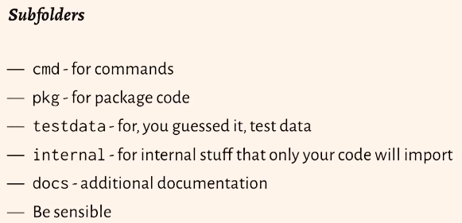
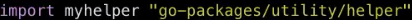

# Source

https://www.youtube.com/watch?v=cmkKxNN7cs4 (first 7 bullet points)
https://www.youtube.com/watch?v=GnEviKt7U0E

# Notes

* Limit the number of exported functionality
* use generic ("narrow") types 
* single method interfaces are easier to write and use
* write tests!
* suggested structure:

* Leave conurrency to the user
* group things of the same type together (`user` type goes in the `users.go` file)

* You cannot have different packages under the same directory!
* PascalCase makes functions public
* It's good practice to name a package and its folder the same
* you can alias/rename an imported package:

* this package is executable because there is a main() function and package. This means you can run `go build` and `go run`

